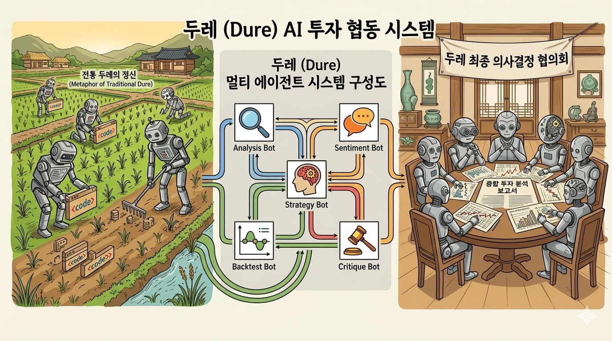

# Dure (두레)



Dure는 투자 리서치 워크플로우를 여러 AI 에이전트로 오케스트레이션하는 CLI 워크벤치입니다.
한 종목 분석부터 스크리닝, 전략 리서치, 거시 시나리오 분석까지 하나의 진입점에서 실행하고, 결과를 HTML 리포트와 실행 아티팩트로 남깁니다.

## What Dure Does

Dure는 요청 유형에 따라 적절한 에이전트 조합을 실행합니다.

- `chat`: 자연어로 요청하면 router가 적절한 워크플로우 도구로 연결합니다.
- `equity`: 단일 종목에 대해 펀더멘털, 뉴스, 전략 논리, critic 검토를 종합합니다.
- `screen`: 시장과 스타일 기준으로 후보 종목을 추리고 상위 종목을 분석합니다.
- `strategy`: 투자 가설을 전략 규칙으로 만들고 critic 루프로 다듬습니다.
- `scenario`: 거시 이벤트나 가정이 종목과 섹터에 미칠 영향을 정리합니다.

대표적인 에이전트 구성은 다음과 같습니다.

- Universe: 유니버스 구성, 스크리닝 후보 수집
- Fundamental: 재무제표, 밸류에이션, 지표 분석
- News: 뉴스 이벤트와 감성 요약
- Strategy: 투자 전략과 실행 규칙 설계
- Critic: 과적합, 논리 비약, 데이터 한계 검토
- Scenario: 시나리오 영향 분석
- Review Checklist: 기존 종목 분석 결과 재검토
- Router: 대화형 요청 라우팅

## Quick Start

### 1. Clone dependencies

이 저장소는 단독으로 완결되지 않습니다.
시장 데이터와 보조 도구 실행을 위해 `cluefin` 저장소가 함께 필요합니다.

```bash
git clone https://github.com/kgcrom/cluefin-dure
git clone https://github.com/kgcrom/cluefin

cd cluefin-dure
npm install
cp .env.example .env
```

기본적으로 Dure는 `../cluefin`을 외부 워크스페이스 경로로 가정합니다.
다른 위치에 clone했다면 `.env`에 `CLUEFIN_CLI_CWD`를 명시해야 합니다.

```bash
CLUEFIN_CLI_CWD=../cluefin
```

### 2. Fill environment variables

`.env`에는 최소한 아래 데이터 소스 설정이 필요합니다.

- `KIWOOM_APP_KEY`
- `KIWOOM_SECRET_KEY`
- `KIWOOM_ENV`
- `DART_AUTH_KEY`
- `KIS_APP_KEY`
- `KIS_SECRET_KEY`
- `KIS_ENV`
- `CLUEFIN_CLI_CWD`

전체 목록과 모델 설정은 [docs/configuration.md](docs/configuration.md)를 참고하세요.

### 3. Run commands

```bash
# 대화형 모드
npm run chat

# 종목 종합 분석
npm run equity -- 005930

# 스크리닝
npm run screen -- KR value

# 전략 리서치
npm run strategy -- "quality dividend growth"

# 시나리오 분석
npm run scenario -- "연준이 50bp 긴급 인하하면 반도체 섹터 어떻게 되나?"
```

`npm run <script>` 뒤에 인수를 넘길 때는 `--` 구분자가 필요합니다.

## How It Works

CLI 진입점은 [`src/main.ts`](src/main.ts)입니다.
각 명령은 워크플로우를 실행한 뒤 리포트를 생성하고, 터미널에 요약을 출력합니다.

주요 흐름은 다음과 같습니다.

- `equity`: Universe 또는 단일 종목 입력 -> Fundamental + News -> Strategy -> Critic 반복
- `screen`: Universe -> 상위 종목 Fundamental 분석
- `strategy`: Strategy 초안 -> Critic 반복
- `scenario`: Scenario 정의 -> 영향 분석 -> 종합 평가
- `chat`: Router가 `equity`, `screen`, `strategy`, `scenario`, `review_checklist` 도구 중 하나를 호출

대화형 모드의 종목 분석은 equity 워크플로우 뒤 checklist review까지 자동으로 이어집니다.

## Outputs

각 실행 결과는 `data/runs/<runId>/` 아래에 저장됩니다.

- `report.html`: 사람이 읽는 최종 리포트
- `events.json`: 실행 이벤트 로그
- `<agent>/artifact.json`: 에이전트별 중간 산출물

macOS에서는 리포트 생성 직후 HTML 파일을 자동으로 엽니다.

예시 결과는 `docs/examples/` 아래에 있습니다.

- [chat_result.md](docs/examples/chat_result.md)
- [scenario_report.html](docs/examples/scenario_report.html)
- [screen_report.html](docs/examples/screen_report.html)
- [strategy_report.html](docs/examples/strategy_report.html)

## Model Configuration

기본 provider preset은 `openai-codex`입니다.
에이전트별 모델 선택 우선순위는 아래와 같습니다.

```text
DURE_MODEL_{AGENT} > DURE_PROVIDER > 코드 기본값
```

예시:

```bash
# 전체 provider 변경
DURE_PROVIDER=openai-codex npm run chat

# critic만 override
DURE_PROVIDER=openai-codex \
DURE_MODEL_CRITIC=anthropic:claude-opus-4-6 \
npm run strategy -- "quality dividend growth"
```

자세한 preset과 agent별 기본 모델은 [docs/configuration.md](docs/configuration.md)에 정리되어 있습니다.

## Repository Layout

```text
src/
├── agents/        # 에이전트 정의
├── workflow/      # 워크플로우 오케스트레이션
├── tools/         # 시장 데이터 및 워크플로우 도구
├── schemas/       # 분석 결과 스키마
├── memory/        # 파일 기반 메모리 저장소
├── runtime/       # 세션/이벤트/아티팩트 관리
├── report/        # HTML 리포트 생성
├── interactive/   # 대화형 모드
├── cli/           # cluefin CLI 브리지
├── config.ts      # 모델 설정
└── main.ts        # CLI 엔트리포인트
research/
└── prompts/       # 공통 및 역할별 프롬프트
docs/
├── architecture.md
├── configuration.md
└── examples/
```

## Related Docs

- [docs/configuration.md](docs/configuration.md): `.env`, provider preset, agent별 모델 override
- [docs/architecture.md](docs/architecture.md): 워크플로우, 에이전트 구성, 메모리, 실행 산출물
- [docs/TODO.md](docs/TODO.md): 남아 있는 작업 메모

## Development

작업을 마친 뒤 아래 검증을 실행합니다.

```bash
npm test
npm run lint
```
