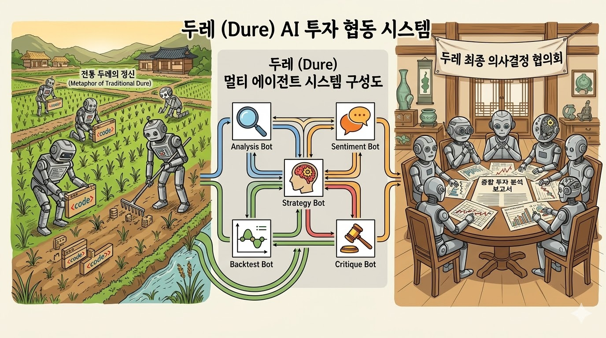

# Dure (두레)



Dure는 한국 시장 투자 리서치 워크벤치입니다.
별도의 CLI를 만들지 않고, 코딩 에이전트의 project-local resource로 시장 데이터 도구와 분석 워크플로우를 구성합니다.
시장과 종목을 입력하면 데이터 수집부터 기본적/기술적/뉴스/매크로 분석, 데이터 점검, 포트폴리오 적합성, bull/bear 의견, 최종 판단까지 하나의 진입점에서 실행합니다.

Dure는 **두 가지 에이전트 런타임**을 지원합니다.

- **[Pi coding agent](https://www.npmjs.com/package/@earendil-works/pi-coding-agent)** — `.pi/` 리소스로 동작 (`npm run chat`)
- **[Claude Code](https://docs.claude.com/en/docs/claude-code)** — `.claude/` 리소스 + `.mcp.json`으로 동작

두 런타임은 동일한 cluefin 기반 시장 데이터 계층(`.pi/extensions/market-data/`)을 공유합니다.
도구를 등록하는 진입점만 런타임별로 다릅니다(Pi extension vs MCP server).

## What Dure Does

| 구성 | Pi | Claude Code |
| --- | --- | --- |
| 도구 등록 | Extension `index.ts` (Pi runtime) | MCP server `mcp-server.ts` (`.mcp.json`) |
| 오케스트레이션 | Prompt `/market-review` | `market-review` 서브에이전트 (`.claude/agents/`) |
| 분석 역할 | Skills `.pi/skills/*` | Skills `.claude/skills/*` |

공통적으로 KIS·DART 데이터를 가져오는 도구는 cluefin 프로젝트의 Python CLI(`cluefin-openapi-cli`)를 `uv run`으로 호출합니다.

### Analysis skills

`.pi/skills/`와 `.claude/skills/`에 동일하게 제공됩니다.

| Skill | 역할 |
| --- | --- |
| `fundamental-analysis` | 재무제표, 밸류에이션, 성장성, 수익성, 현금흐름, 부채 구조 |
| `technical-analysis` | 이동평균, 거래량, RSI, MACD, 지지/저항, 추세 전환 |
| `news-analysis` | 뉴스, 공시, 실적, 산업 이벤트를 호재/악재/중립으로 분류 |
| `macro-analysis` | 환율, 미국/한국 금리, 미국채/국고채, 유동성 환경 |
| `data-sanity-check` | 기준일, 누락, 충돌, 종목 식별, 가격 조정 여부 점검 |
| `portfolio-fit` | 기존 포트폴리오와 신규/기존 종목의 적합성 |
| `scenario-planner` | bull / base / bear 시나리오와 조건, 예상 가격 범위 |
| `risk-position-sizing` | 진입가, 손절가, 목표가, 손익비, 포지션 크기 |
| `bull-analyst` | 동일 데이터에서 긍정 투자 논리 구성 |
| `bear-analyst` | 동일 데이터에서 부정 투자 논리 구성 |
| `final-decision` | buy/hold/sell/watch, 기준선, 무효화 조건, 추적 지표 |
| `investment-journal` | 투자 판단과 사후 복기를 `investments/journal/`에 기록 |

### Market data tools

`market-data` 계층이 노출하는 도구는 다음과 같습니다. Claude Code에서는 `mcp__market-data__<tool>` 형태로 호출됩니다.

- `market_data_health`: cluefin CLI 실행 가능 여부와 KIS/DART 키 설정 여부 점검 (키 값은 노출하지 않음)
- `kis_stock_current_price`: 현재가
- `kis_price_history`: OHLCV 가격 이력 (기술적 분석용)
- `kis_financials`: 재무제표 및 재무비율 번들
- `kis_financials_windowed`: 최근 5개년 연간(YYYY12) 우선, 부족하면 최근 12개 기간으로 fallback
- `kis_market_announcement`: KIS 시장 뉴스/공시 제목
- `dart_corp_code_lookup`: DART 기업 고유번호 목록 다운로드
- `dart_company_overview`: 8자리 corp code로 기업 개요 조회
- `dart_disclosure_search`: corp code, 기간, 공시 유형 기준 공시 검색

## Quick Start

### 1. Clone dependencies

이 저장소는 단독으로 완결되지 않습니다.
시장 데이터 도구는 `cluefin` 저장소의 Python CLI(`cluefin-openapi-cli`)를 `uv run`으로 호출하므로, `cluefin`과 [`uv`](https://docs.astral.sh/uv/)가 함께 필요합니다.

```bash
git clone https://github.com/kgcrom/cluefin-dure
git clone https://github.com/kgcrom/cluefin

cd cluefin-dure
npm install
cp .env.example .env
```

`market-data` 계층은 기본적으로 `~/workspace/cluefin`을 cluefin CLI 실행 경로로 가정합니다.
다른 위치에 clone했다면 `.env`에 `CLUEFIN_OPENAPI_CWD`로 경로를 지정합니다.

```bash
CLUEFIN_OPENAPI_CWD=/path/to/cluefin
```

### 2. Fill environment variables

`.env`에는 데이터 소스 키가 필요합니다.

- `KIWOOM_APP_KEY`, `KIWOOM_SECRET_KEY`, `KIWOOM_ENV`
- `KIS_APP_KEY`, `KIS_SECRET_KEY`, `KIS_ENV`
- `DART_AUTH_KEY`
- `CLUEFIN_OPENAPI_CWD` (cluefin이 `~/workspace/cluefin`이 아닐 때만)

### 3. Run

#### Pi coding agent

```bash
npm run chat
```

`npm run chat`은 Pi coding agent CLI를 `.env`와 함께 실행합니다.
대화형 모드에서 `/market-review` 프롬프트로 투자 검토를 시작합니다.

```text
/market-review KOSPI 005930
/market-review KOSDAQ 247540
```

#### Claude Code

MCP server는 컴파일된 JS(`dist/.pi/extensions/market-data/mcp-server.js`)를 실행하므로, 먼저 빌드한 뒤 저장소 안에서 Claude Code를 실행합니다.

```bash
npm run build   # mcp-server.js 생성 (.mcp.json이 참조)
claude          # 저장소 안에서 실행
```

`.mcp.json`이 `market-data` MCP server를, `.claude/`가 스킬과 `market-review` 서브에이전트를 자동 등록합니다.
`market-review` 에이전트에 시장/종목을 전달하면 동일한 검토 흐름이 실행됩니다.

```text
> market-review 에이전트로 KOSPI 005930 검토해줘
```

## How It Works

`/market-review`(Pi)와 `market-review` 서브에이전트(Claude Code)는 동일한 순서를 지시합니다.

1. 시장과 종목 식별
2. 기본적 분석 데이터 수집 (가능하면 최근 5개년 연간, 부족하면 최근 12개 기간)
3. 기술적 분석 데이터 수집 (가능하면 수정주가 일봉 2년치, 한도 초과 시 구간 분할 후 병합)
4. 최근 뉴스 수집
5. 환율, 미국/국내 금리, 채권 등 매크로 데이터 수집
6. `data-sanity-check`로 기준일, 누락, 충돌, 사용 가능 여부 점검
7. `portfolio-fit`로 기존 포트폴리오 적합성 확인
8. `bull-analyst` 긍정 의견
9. `bear-analyst` 부정 의견
10. `final-decision`으로 buy/hold/sell/watch, 기준선, 손절선, 확인 조건 제시
11. 필요 시 `investment-journal` 형식으로 기록 제안

주요 가드레일:

- 데이터가 없으면 없다고 명시하며, 투자 조언이 아닌 의사결정 보조 리포트로 작성합니다.
- `data-sanity-check` 결과가 blocked이면 확정적인 buy/sell 의견을 내지 않습니다.
- KIS API 요청은 동시에 최대 2개로 제한하고, 토큰/호출 제한 오류 시 확정 판단을 미룹니다.
- 사용자의 명시적 요청 없이 `investments/`의 보유 수량, 평균단가, 현금 잔고를 수정하지 않습니다.

## Investments Data

`portfolio-fit`과 `investment-journal` 스킬은 사용자별 로컬 데이터를 읽고 씁니다.
런타임에 따라 `.pi/investments/` 또는 `.claude/investments/`를 사용합니다.

- `portfolio.yaml`, `watchlist.yaml`, `transactions.csv`: 보유/관심 종목과 거래 기록
- `journal/`: 투자 판단과 사후 복기 기록

이 데이터는 개인 자료이므로 커밋하지 않습니다 (`.gitignore`에서 `.pi/investments/`, `.claude/investments/` 모두 제외).

## Repository Layout

```text
.pi/
├── extensions/
│   └── market-data/        # KIS, DART 데이터 도구 — cluefin CLI(uv) 브리지
│       ├── index.ts        # Pi tool 등록 진입점
│       ├── mcp-server.ts   # MCP stdio server 진입점 (Claude Code용)
│       ├── cli.ts          # cluefin-openapi-cli 실행
│       ├── providers/      # kis.ts, dart.ts (런타임 비의존)
│       └── types.ts
├── prompts/
│   └── market-review.md    # /market-review 진입점 프롬프트 (Pi)
└── skills/                 # 분석 역할 스킬 (Pi)
.claude/
├── agents/
│   └── market-review.md    # market-review 서브에이전트 (Claude Code 오케스트레이터)
└── skills/                 # 분석 역할 스킬 (Claude Code, .pi/skills와 동일)
.mcp.json                   # market-data MCP server 등록 (Claude Code)
docs/
├── TODO.md                 # 남아 있는 작업 메모
└── assets/                 # 로고 등 정적 리소스
```

## Development

작업을 마친 뒤 아래 검증을 실행합니다.

```bash
npm test       # vitest (--passWithNoTests)
npm run lint   # biome check
npm run format # biome format --write
npm run build  # tsc (mcp-server.js 등 dist/ 생성)
```

## Related Docs

- [docs/TODO.md](docs/TODO.md): `investment-decision` extension 도입 검토 등 남아 있는 작업 메모
